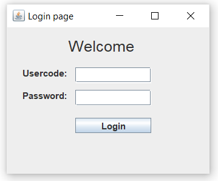
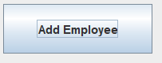
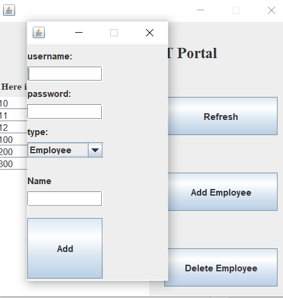
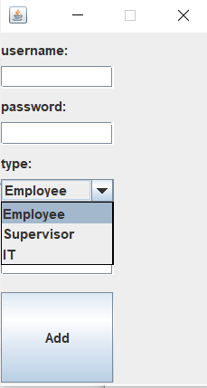

# work_place_system
It's a full stack software that organize a work place system between Employee and manager/supervisor.
It's created using **Java and SQL Database**

After running the software, you will recieve a login page which will ask for the usercode and password - In a real life scenario, you will recieve your usercode and password from the IT desk when you arrive to your workplace- Therefore, there is a type of Employee which is IT - who is reponsibile for adding and removing any Employee from the company system.

**To test the software, please download both .exe file and .db file and try usercode: 10 and password 12.**

In case you did that, you will open the IT portal - which is responsible for adding/removing employee from a company.

As shown in the portal, there are 3 buttons : Add Employee , Delete Employee , and Refresh.

Starting with

It's responsible in adding any new employee to the company, therefore after selecting this option a new frame will be opened asking for the usercode - Primary key of the Employee database and it MUST be unique , I believe I should fix this part by making a series of number to avoid assigning a non-unique value - By the way, in case of trying to assign a non-unique value, it will not assign or overlap the old value since it will cause a SQL exception and the query will not run in the backend- 

There are 3 types of Employee : IT , Supervisor, and Employee.

In case of adding a new Employee of type *IT*, he/she will have an access to the same IT portal shown above and will be able to add or remove Employee.

