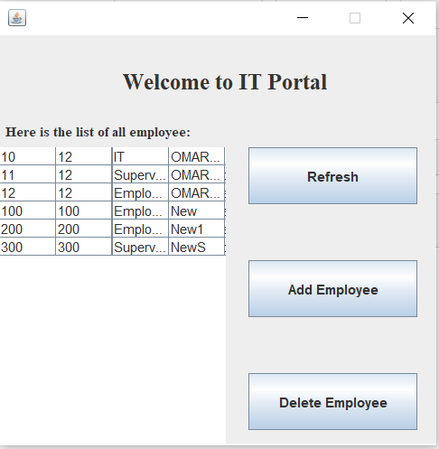

# work_place_system
It's a full stack software that organize a work place system between Employee and manager/supervisor.
It's created using **Java and SQL Database**

After running the software, you will recieve a login page which will ask for the usercode and password - In a real life scenario, you will recieve your usercode and password from the IT desk when you arrive to your workplace- Therefore, there is a type of Employee which is IT - who is reponsibile for adding and removing any Employee from the company system.

**To test the software, please download both .exe file and .db file and try usercode: 10 and password 12.**

In case you did that, you will open the IT portal - which is responsible for adding/removing employee from a company.

Here is shown of all employee and their information - Usercode , password , type, and name. 

As shown in the portal, there are 3 buttons : Add Employee , Delete Employee , and Refresh.

Starting with

It's responsible in adding any new employee to the company, therefore after selecting this option a new frame will be opened asking for the usercode - Primary key of the Employee database and it MUST be unique , I believe I should fix this part by making a series of number to avoid assigning a non-unique value - By the way, in case of trying to assign a non-unique value, it will not assign or overlap the old value since it will cause a SQL exception and the query will not run in the backend- 

There are 3 types of Employee : IT , Supervisor, and Employee.

Going to the account of usercode 12 and password 12 - Employee with usercode 12, the new task named " Do this " will be reflected in the portal.

As shown there, there are 3 tasks assigned to this Employee.

After completeing the task, the employee can simply highlight the task completed, then clicks on completed.

In case of adding a new Employee of type *IT*, he/she will have an access to the same IT portal shown above and will be able to add or remove Employee.

To try an Employee of type Supervisor, you can try usercode 11 and password 12 - It's the same information found in the table above.

When you enter this usercode and password, a Supervisor portal will open which will show a combobox that contains all Employee - only regular Employee not supervisors or IT- and there will be a textfield that will ask for entering a task and there is a button for assigning. 

Assigning a task named - Do this. to Employee with usercode 12 will reflect back in the Employee portal with a pop-message will show informing that the task was added succesfully.

After clicking completed, a message will pop-up notifying the employee that supervisor will be notified with completed task.

There are another button which is Refresh. It's responsible for refreshing the frame to update the portal to make sure receivng up-to-date tasks.

So after clicking refresh here, we can see that Do this will be removed from the list since it's completed by the Employee.

Returning back the supervisor portal, there is a button of completed tasks; the supervisor will be able to see the tasks that are completed by the employee

There is also a button for emptying list. This will cause in deleting the whole database of completed items.

Here are the schema and tables used in the database

